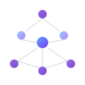

<h1 style="font-size: 44px; font-weight: 700; color: #F0F6FC; margin: 0 0 4px; letter-spacing: -1.5px; line-height: 1.1;">Alejandro Piracés</h1>

Software Engineer

From enterprise software to security engineering. I build systems that last and study how they break.

 

<h2 style="font-size: 20px; font-weight: 600; color: #F0F6FC; margin: 0 0 20px;">About</h2>

Curiosity drives everything I build. I don't settle for making it work — I study how it works, how it breaks, and how it evolves. That mindset separates working software from great software.

It took me from the military to enterprise development, from software engineering to AI, cloud, and now cybersecurity. Every layer I've mastered adds a new dimension to how I approach problems.

 

<h2 style="font-size: 20px; font-weight: 600; color: #F0F6FC; margin: 0 0 24px;">Focus Areas</h2>

<table style="width: 100%; border-collapse: collapse; border: none;">
<tr>
<td style="width: 50%; padding: 6px; border: none; vertical-align: top;">

<h3 style="font-size: 14px; font-weight: 600; color: #7C3AED; margin: 12px 0 6px;">Artificial Intelligence</h3>

LLM integration, RAG pipelines, AI agents, MCP, and practical enterprise AI.

</td>
<td style="width: 50%; padding: 6px; border: none; vertical-align: top;">

<h3 style="font-size: 14px; font-weight: 600; color: #00C896; margin: 12px 0 6px;">Cybersecurity</h3>

Pentesting, OWASP Top 10, threat modeling, and security-by-design principles.

</td>
</tr>
</table>

 

<h2 style="font-size: 20px; font-weight: 600; color: #F0F6FC; margin: 0 0 20px;">Path</h2>

From the Spanish Army to enterprise software. From software engineering to a cybersecurity focus. Each chapter builds on the last.

 

<h2 style="font-size: 20px; font-weight: 600; color: #F0F6FC; margin: 0 0 24px;">Principles</h2>

<table style="width: 100%; border-collapse: collapse; border: none;">
<tr>
<td style="width: 50%; padding: 6px; border: none; vertical-align: top;">

01

<h4 style="margin: 0 0 4px; font-size: 14px; color: #F0F6FC; font-weight: 600;">Think First, Code Later</h4>

An hour of thinking saves a week of refactoring.

</td>
<td style="width: 50%; padding: 6px; border: none; vertical-align: top;">

02

<h4 style="margin: 0 0 4px; font-size: 14px; color: #F0F6FC; font-weight: 600;">Security by Default</h4>

Security is a property of every decision in the stack.

</td>
</tr>
<tr>
<td style="width: 50%; padding: 6px; border: none; vertical-align: top;">

03

<h4 style="margin: 0 0 4px; font-size: 14px; color: #F0F6FC; font-weight: 600;">Simplicity Over Complexity</h4>

The best solutions are boring, predictable, and easy to reason about.

</td>
<td style="width: 50%; padding: 6px; border: none; vertical-align: top;">

04

<h4 style="margin: 0 0 4px; font-size: 14px; color: #F0F6FC; font-weight: 600;">Master Principles, Not Tools</h4>

Frameworks change. SOLID and critical thinking endure.

</td>
</tr>
<tr>
<td style="width: 50%; padding: 6px; border: none; vertical-align: top;">

05

<h4 style="margin: 0 0 4px; font-size: 14px; color: #F0F6FC; font-weight: 600;">Continuous Learning</h4>

The ability to learn is the only lasting skill in technology.

</td>
<td style="width: 50%; padding: 6px; border: none; vertical-align: top;">

06

<h4 style="margin: 0 0 4px; font-size: 14px; color: #F0F6FC; font-weight: 600;">Full-Stack Understanding</h4>

From kernel to cloud. Depth over breadth.

</td>
</tr>
</table>

 

<h2 style="font-size: 20px; font-weight: 600; color: #F0F6FC; margin: 0 0 24px;">Stack</h2>

<table style="width: 100%; border-collapse: collapse; border: none;">
<tr>
<td style="width: 33%; padding: 6px; border: none; vertical-align: top;">

Backend

 

ASP.NET Core · EF Core · CQRS

</td>
<td style="width: 33%; padding: 6px; border: none; vertical-align: top;">

Cloud & DevOps

  

Azure · DevOps · Docker · CI/CD

</td>
<td style="width: 33%; padding: 6px; border: none; vertical-align: top;">

Database

 

SQL Server · PostgreSQL · MySQL

</td>
</tr>
<tr>
<td style="width: 50%; padding: 6px; border: none; vertical-align: top;">

AI & ML

OpenAI · Azure AI · RAG · Agents · MCP

</td>
<td style="width: 50%; padding: 6px; border: none; vertical-align: top;">

Security

CEH · OWASP Top 10 · Pentesting · Threat Modeling

</td>
</tr>
</table>

 

<h2 style="font-size: 20px; font-weight: 600; color: #F0F6FC; margin: 0 0 20px;">GitHub</h2>

  

 

 

Built with curiosity · Driven by principles

&copy; 2026 Alejandro Piracés

