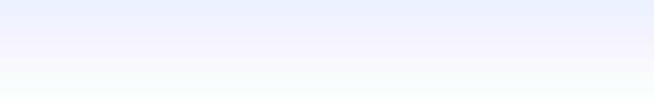
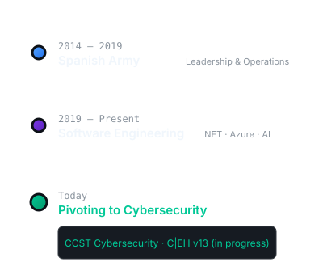

<h1 style="font-size: 44px; font-weight: 700; color: #F0F6FC; margin: 0 0 4px; letter-spacing: -1.5px; line-height: 1.1;">Alejandro Piracés Pérez</h1>

Software Engineer

From enterprise software to security engineering. I build systems that last and study how they break.

   Technologies  

 

<h2 style="font-size: 20px; font-weight: 600; color: #F0F6FC; margin: 0 0 20px;">About</h2>

Curiosity drives everything I build. I don't settle for making it work — I study how it works, how it breaks, and how it evolves. That mindset separates working software from great software.

It took me from the military to enterprise development, from software engineering to AI, cloud, and now cybersecurity. Every layer I've mastered adds a new dimension to how I approach problems.

 

<h2 style="font-size: 20px; font-weight: 600; color: #F0F6FC; margin: 0 0 20px;">Path</h2>

From the Spanish Army to enterprise software. From software engineering to a cybersecurity focus. Each chapter builds on the last.

 

<h2 style="font-size: 20px; font-weight: 600; color: #F0F6FC; margin: 0 0 20px;">GitHub</h2>

 

 

 

Built with curiosity · Driven by principles

&copy; 2026 Alejandro Piracés

